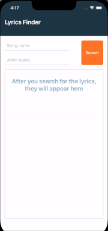

<h1 align="center">
    
</h1>

<h5 align="center">(All changes made to this repository after the test period has ended are purely aesthetic.)</h5>

<h3 align="center">Challenge made in the Sitemate selection process</h3>


<p align="center">
  
</p>

<p align="center">
 <a href="#information_source-how-to-use">How to use</a> • 
 <a href="#memo-license">License</a>
</p>

<br>
<br>

<p align="center">
  
</p>

<br>

# :information_source: How to use

To run the app, you will need to have [development environment](https://reactnative.dev/docs/environment-setup) _(React Native CLI)_ configured for both Android and iOS on your machine. If you already have yours set up, just follow the steps:

```bash
# Clone this repository
$ git clone https://github.com/saymon-araujo/sitemate-techinal-test

# Navigate to the repository folder
$ cd sitemate-techinal-test

# Install the dependencies
$ npm install
$ cd ios && pod install && cd ..

#  Run the app (Android)
$ yarn android

#  Run the app (iOS)
$ yarn ios

```

<br>
<br>

# :memo: License

This project is under the MIT license. See the [LICENSE](https://github.com/saymon-araujo/sitemate-techinal-test/blob/main/LICENSE) for more information.

---

Made by Saymon Araújo, 👋 [Get in Touch!](https://www.linkedin.com/in/saymon-araujo/)
